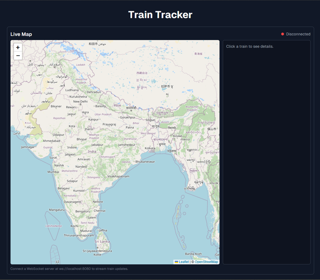
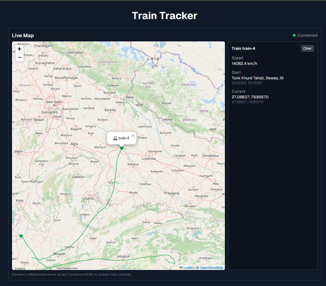

# Capstone Frontend

A Next.js frontend with real-time and historical train tracking over India using Leaflet maps and WebSocket updates.

## Features

- **Live Tracking**: Real-time train positions via WebSocket with animated markers and trails
- **Historical Tracking**: Search train history by ID with date range filters and automatic stop detection
- **Tabbed Interface**: Switch between Live and History views (responsive: dropdown on mobile, tabs on desktop)
- **Interactive Maps**: Click trains to select, view trails, and follow movement

## Stack
- Next.js 15 (App Router) + React 19
- Tailwind CSS + shadcn/ui
- Leaflet (Canvas renderer)
- Bun (dev runtime and mock WS server)

## Quick start

Prerequisites: Bun installed (`https://bun.sh`).

Install and run dev server:
```bash
bun install
bun run dev
```
Open `http://localhost:3000`.

## Real-time WebSocket server
Run the mock server provided (listens on port `8080`):
```bash
bun ./webS/server.mjs
```

The client automatically configures the WebSocket URL:
- Uses `NEXT_PUBLIC_WS_URL` if set
- Otherwise defaults to `ws://localhost:8000` in dev, `wss://<hostname>:8000` in production

**To use the mock server**, set the environment variable:
```bash
NEXT_PUBLIC_WS_URL=ws://localhost:8080
```

The server emits train updates every second with shape:
```json
{ "id": "train-1", "lat": 20.59, "lng": 78.96, "popup": "optional" }
```
You can also send an array of such objects. The component accepts both `id`/`train_id` and `lng`/`lon` field names.

See `docs/websocket-quickstart.md` for detailed WebSocket integration guide.

## Historical Tracking API
The History tab expects a REST API endpoint at `/api/history`:
- Query params: `train_id` (required), `from` (ISO datetime), `to` (ISO datetime)
- Response: Array of `[{ lat, lng, timestamp(ms), speed? }, ...]` ordered by timestamp

The component automatically detects stops (speed ≤ 0.5 km/h or unchanged position for ≥ 5 minutes) and marks them on the map.

## Tips
- **Live Map**: Click a train marker to select and view details
- **History Map**: Use quick range buttons (1h, 6h, 24h) or set custom date ranges
- Trails keep last 500 points; marker/trail sizes scale with zoom
- Stale trains (no updates for 10 minutes) are automatically removed from the live map

## Config
- **WebSocket URL**: Set `NEXT_PUBLIC_WS_URL` environment variable, or it defaults to `ws://localhost:8000` in dev
- The WebSocket connection includes automatic reconnection with exponential backoff and heartbeat/ping-pong

## Scripts
- Dev: `bun run dev`
- Build: `bun run build`
- Start: `bun run start`
- WS server: `bun ./webS/server.mjs`

## Structure
```
app/                    # Next.js app router pages
  page.tsx              # Main page with tabbed interface
components/             # shadcn/ui components
src/components/
  RealTimeLeafletMap.jsx    # Live tracking component
  HistoryComponent.jsx       # Historical tracking component
  TrainTabs.jsx             # Tab switcher (responsive)
  SimpleDropdown.jsx        # Mobile dropdown component
webS/
  server.mjs            # Mock WebSocket server
docs/
  websocket-quickstart.md   # WebSocket integration guide
```

## Screenshots






## License
MIT
